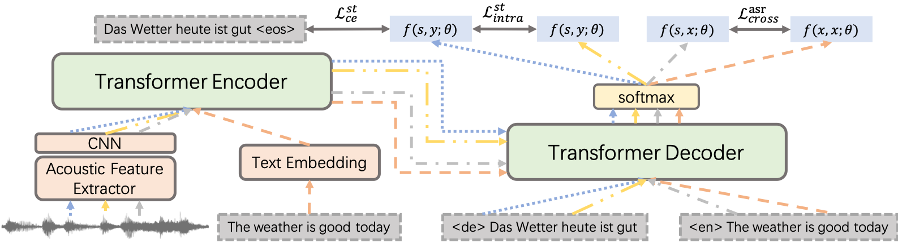

# An Empirical Study of Consistency Regularization for End-to-End Speech-to-Text Translation
This repository contains the PyTorch implementation (**Unofficial**) for our arXiv paper "[An Empirical Study of Consistency Regularization for End-to-End Speech-to-Text Translation](https://arxiv.org/abs/2308.14482)".



## Requirements and Installation

This work has been tested in the following environment.

* Python version == 3.7.0
* PyTorch version == 1.11.0
* Fairseq version == 0.12.2

## Reproduction on Regular E2E ST

The following instructions can be used to train a W2V2-Transformer model on the MuST-C English to German dataset in the regular E2E ST setting, where the WMT16 English to German dataset is used as the external MT dataset.

### Preprocessing

Download and unpack [MuST-C v1.0 English to German](https://ict.fbk.eu/must-c) dataset, which contains more than 400 hours of audio recording from TED Talks with the corresponding transcriptions and translations, to a path `MUST_C/en-de`, then preprocess it with

```
# Prepare MuST-C dataset
python3 utils/prep_mustc_data.py \
    --data-root MUST_C --language de \
    --vocab-type unigram --vocab-size 10000 --use-audio-input

# Add language tag to the vocabulary
echo "<SRC> 1" >> MUST_C/en-de/spm_unigram10000.txt
echo "<TGT> 1" >> MUST_C/en-de/spm_unigram10000.txt

# Extract MT data from MuST-C dataset
DIR_IN=MUST_C/en-de
DIR_OUT=MUST_C_MT/MUST_C_en_de

mkdir -p $DIR_OUT

python3 utils/extract_mustc_data.py --dir-in ${DIR_IN} --dir-out ${DIR_OUT} --lang de --file train
python3 utils/extract_mustc_data.py --dir-in ${DIR_IN} --dir-out ${DIR_OUT} --lang de --file dev
python3 utils/extract_mustc_data.py --dir-in ${DIR_IN} --dir-out ${DIR_OUT} --lang de --file tst-COMMON

# Apply BPE to MuST-C MT dataset
SPM=MUST_C/en-de/spm_unigram10000.model
DIR=MUST_C_MT/MUST_C_en_de

python3 utils/spm_encode.py --model ${SPM} --output_format piece --inputs ${DIR}/train.en --outputs ${DIR}/train.spm.en
python3 utils/spm_encode.py --model ${SPM} --output_format piece --inputs ${DIR}/dev.en --outputs ${DIR}/dev.spm.en
python3 utils/spm_encode.py --model ${SPM} --output_format piece --inputs ${DIR}/tst-COMMON.en --outputs ${DIR}/tst-COMMON.spm.en

python3 utils/spm_encode.py --model ${SPM} --output_format piece --inputs ${DIR}/train.de --outputs ${DIR}/train.spm.de
python3 utils/spm_encode.py --model ${SPM} --output_format piece --inputs ${DIR}/dev.de --outputs ${DIR}/dev.spm.de
python3 utils/spm_encode.py --model ${SPM} --output_format piece --inputs ${DIR}/tst-COMMON.de --outputs ${DIR}/tst-COMMON.spm.de

# Binarize MuST-C MT dataset
TEXT_MT=MUST_C_MT/MUST_C_en_de
TEXT_ST=MUST_C_MT/MUST_C_en_de
DIR=data-bin/MUST_C_MT_en_de
DICT=MUST_C/en-de/spm_unigram10000.txt

mkdir -p data-bin

fairseq-preprocess --source-lang en --target-lang de \
    --trainpref ${TEXT_MT}/train.spm --validpref ${TEXT_ST}/dev.spm --testpref ${TEXT_ST}/tst-COMMON.spm \
    --destdir ${DIR} \
    --srcdict ${DICT} --tgtdict ${DICT} \
    --workers 20
```

Download and unpack [WMT16 English to German](https://www.statmt.org/wmt16/translation-task.html) dataset, then preprocess it with
```
echo 'Cloning Moses github repository (for tokenization scripts)...'
git clone https://github.com/moses-smt/mosesdecoder.git


# Prepare WMT16 dataset
DIR=MUST_C_MT/WMT16_en_de

mkdir -p $DIR

cat europarl-v7.de-en.en >> ${DIR}/train.en
cat commoncrawl.de-en.en >> ${DIR}/train.en
cat news-commentary-v11.de-en.en >> ${DIR}/train.en

cat europarl-v7.de-en.de >> ${DIR}/train.de
cat commoncrawl.de-en.de >> ${DIR}/train.de
cat news-commentary-v11.de-en.de >> ${DIR}/train.de

# Preprocess WMT16 dataset
SPM=MUST_C/en-de/spm_unigram10000.model
DIR=MUST_C_MT/WMT16_en_de
SCRIPTS=mosesdecoder/scripts
CLEAN=$SCRIPTS/training/clean-corpus-n.perl

perl $CLEAN ${DIR}/train en de ${DIR}/train.filter 1 1024

python3 utils/spm_encode.py --model ${SPM} --output_format piece --inputs ${DIR}/train.filter.en --outputs ${DIR}/train.spm.en
python3 utils/spm_encode.py --model ${SPM} --output_format piece --inputs ${DIR}/train.filter.de --outputs ${DIR}/train.spm.de

perl $CLEAN -ratio 1.5 ${DIR}/train.spm en de ${DIR}/train.filter.spm 1 1024

# Binarize WMT16 dataset
TEXT_MT=MUST_C_MT/WMT16_en_de
TEXT_ST=MUST_C_MT/MUST_C_en_de
DIR=data-bin/WMT16_en_de
DICT=MUST_C/en-de/spm_unigram10000.txt

mkdir -p data-bin

fairseq-preprocess --source-lang en --target-lang de \
    --trainpref ${TEXT_MT}/train.filter.spm --validpref ${TEXT_ST}/dev.spm --testpref ${TEXT_ST}/tst-COMMON.spm \
    --destdir ${DIR} \
    --srcdict ${DICT} --tgtdict ${DICT} \
    --workers 20
```

Download [Wav2Vec 2.0 Base](https://dl.fbaipublicfiles.com/fairseq/wav2vec/wav2vec_small.pt) model.

### Training

Pretrain the Transformer model over the WMT16 dataset.

```
EXP=WMT16_en_de_intra05
DATA=data-bin/WMT16_en_de

mkdir -p checkpoint/$EXP
mkdir -p log/$EXP

CUDA_VISIBLE_DEVICES=0,1,2,3,4,5,6,7 fairseq-train $DATA \
    --user-dir ./user_src \
    --task translation --arch transformer_wmt_en_de_t2t --share-all-embeddings --dropout 0.1 \
    --optimizer adam --adam-betas '(0.9, 0.98)' --clip-norm 10.0 --lr-scheduler inverse_sqrt \
    --warmup-init-lr 1e-07 --warmup-updates 8000 --lr 0.001 --stop-min-lr 1e-09 \
    --criterion label_smoothed_cross_entropy_with_mt_intra --alpha 0.5 --label-smoothing 0.1 --weight-decay 0.0 \
    --max-tokens 4096 --update-freq 1 --layernorm-embedding \
    --save-dir checkpoint/$EXP --ddp-backend=no_c10d --no-epoch-checkpoints --fp16 \
    1>log/$EXP/log.out 2>log/$EXP/log.err
```

Finetune the Transformer model over the MuST-C MT dataset.

```
EXP=WMT16_en_de_intra05_MUST_C_MT_en_de_intra1
DATA=data-bin/MUST_C_MT_en_de
CKPT=checkpoint/WMT16_en_de_intra05/checkpoint_best.pt

mkdir -p checkpoint/$EXP
mkdir -p log/$EXP

CUDA_VISIBLE_DEVICES=0,1,2,3,4,5,6,7 fairseq-train $DATA \
    --user-dir ./user_src \
    --task translation --arch transformer_wmt_en_de_t2t --share-all-embeddings --dropout 0.1 \
    --optimizer adam --adam-betas '(0.9, 0.98)' --clip-norm 10.0 --lr-scheduler inverse_sqrt \
    --warmup-init-lr 1e-07 --warmup-updates 8000 --lr 0.001 --stop-min-lr 1e-09 \
    --criterion label_smoothed_cross_entropy_with_mt_intra --alpha 1.0 --label-smoothing 0.1 --weight-decay 0.0 \
    --max-tokens 4096 --update-freq 1 --layernorm-embedding \
    --save-dir checkpoint/$EXP --ddp-backend=no_c10d --no-epoch-checkpoints --fp16 \
    --reset-optimizer --reset-meters --reset-dataloader --reset-lr-scheduler --restore-file $CKPT \
    1>log/$EXP/log.out 2>log/$EXP/log.err
```

Finetune the W2V2-Transformer model over the MuST-C dataset.

```
EXP=WMT16_en_de_intra05_MUST_C_MT_en_de_intra1_MUST_C_ST_en_de_intra3
DATA=MUST_C/en-de
CKPT=checkpoint/WMT16_en_de_intra05_MUST_C_MT_en_de_intra1/checkpoint_best.pt

mkdir -p checkpoint/$EXP
mkdir -p log/$EXP

CUDA_VISIBLE_DEVICES=0,1,2,3,4,5,6,7 fairseq-train $DATA \
    --user-dir ./user_src \
    --config-yaml config.yaml --train-subset train --valid-subset dev \
    --save-dir checkpoints --num-workers 8 --max-tokens 1000000 \
    --task speech_to_text_multitask --criterion label_smoothed_cross_entropy_with_st_intra --alpha 3.0 --label-smoothing 0.1 \
    --optimizer adam --adam-betas '(0.9, 0.98)' --lr 1e-4 --lr-scheduler inverse_sqrt --weight-decay 0.0001 \
    --warmup-updates 4000 --clip-norm 0.0 --update-freq 2 \
    --layernorm-embedding \
    --max-source-positions 900000 --max-target-positions 1024 \
    --arch s2t_transformer_b_w2v_6tenc_6dec --w2v2-model-path wav2vec_small.pt \
    --ddp-backend=no_c10d --skip-invalid-size-inputs-valid-test --fp16 \
    --load-pretrained-mt-encoder-decoder-from $CKPT \
    1>log/$EXP/log.out 2>log/$EXP/log.err
```

### Evaluation

Evaluate our trained model:

```
DATA=MUST_C/en-de

EXP=WMT16_en_de_intra05_MUST_C_MT_en_de_intra1_MUST_C_ST_en_de_intra3
CKPT=checkpoint/$EXP/checkpoint_best.pt

CUDA_VISIBLE_DEVICES=0 fairseq-generate $DATA \
    --task speech_to_text_with_tag \
    --user-dir ./user_src \
    --config-yaml config.yaml --gen-subset tst-COMMON \
    --path $CKPT \
    --max-tokens 2000000 --max-source-positions 900000 --beam 8 --lenpen 1.2 \
    --scoring sacrebleu
```

### Result

Please note that the experimental result is sightly different from that in the paper. 

| Method | BLEU |
| --- | --- |
| W2V2-Transformer | 27.31 |
| &emsp; + SimRegCR | 29.26 |


## Reproduction on Zero-shot E2E ST

The following instructions can be used to train a W2V2-Transformer model on the MuST-C English to German dataset in the zero-shot E2E ST setting, where the WMT14 English to German dataset is used as the external MT dataset.

### Preprocessing

The preprocessing step is almost the same as that in the regular E2E ST setting except that the WMT16 dataset is replaced by the [WMT14 English to German](https://www.statmt.org/wmt14/translation-task.html) dataset.

### Training

Pretrain the Transformer model over the WMT14 dataset.

```
EXP=WMT14_en_de_baseline
DATA=data-bin/WMT14_en_de

mkdir -p checkpoint/$EXP
mkdir -p log/$EXP

CUDA_VISIBLE_DEVICES=0,1,2,3,4,5,6,7 fairseq-train $DATA \
    --user-dir ./user_src \
    --task translation --arch transformer_wmt_en_de_t2t --share-all-embeddings --dropout 0.1 \
    --optimizer adam --adam-betas '(0.9, 0.98)' --clip-norm 10.0 --lr-scheduler inverse_sqrt \
    --warmup-init-lr 1e-07 --warmup-updates 8000 --lr 0.001 --stop-min-lr 1e-09 \
    --criterion label_smoothed_cross_entropy_with_mt_intra --alpha 0.0 --label-smoothing 0.1 --weight-decay 0.0 \
    --max-tokens 4096 --update-freq 1 --layernorm-embedding \
    --save-dir checkpoint/$EXP --ddp-backend=no_c10d --no-epoch-checkpoints --fp16 \
    1>log/$EXP/log.out 2>log/$EXP/log.err
```

Finetune the Transformer model over the MuST-C MT dataset.

```
EXP=WMT14_en_de_baseline_MUST_C_MT_en_de_baseline
DATA=data-bin/MUST_C_MT_en_de
CKPT=checkpoint/WMT14_en_de_baseline/checkpoint_best.pt

mkdir -p checkpoint/$EXP
mkdir -p log/$EXP

CUDA_VISIBLE_DEVICES=0,1,2,3,4,5,6,7 fairseq-train $DATA \
    --user-dir ./user_src \
    --task translation --arch transformer_wmt_en_de_t2t --share-all-embeddings --dropout 0.1 \
    --optimizer adam --adam-betas '(0.9, 0.98)' --clip-norm 10.0 --lr-scheduler inverse_sqrt \
    --warmup-init-lr 1e-07 --warmup-updates 8000 --lr 0.001 --stop-min-lr 1e-09 \
    --criterion label_smoothed_cross_entropy_with_mt_intra --alpha 0.0 --label-smoothing 0.1 --weight-decay 0.0 \
    --max-tokens 4096 --update-freq 1 --layernorm-embedding \
    --save-dir checkpoint/$EXP --ddp-backend=no_c10d --no-epoch-checkpoints --fp16 \
    --reset-optimizer --reset-meters --reset-dataloader --reset-lr-scheduler --restore-file $CKPT \
    1>log/$EXP/log.out 2>log/$EXP/log.err
```

Finetune the W2V2-Transformer model over the MuST-C dataset.

```
EXP=WMT14_en_de_baseline_MUST_C_MT_en_de_baseline_MUST_C_ST_en_de_cross30
DATA=MUST_C/en-de
CKPT=checkpoint/WMT14_en_de_baseline_MUST_C_MT_en_de_baseline/checkpoint_best.pt

mkdir -p checkpoint/$EXP
mkdir -p log/$EXP

CUDA_VISIBLE_DEVICES=0,1,2,3,4,5,6,7 fairseq-train $DATA \
    --user-dir ./user_src \
    --config-yaml config.yaml --train-subset train --valid-subset dev \
    --save-dir checkpoints --num-workers 8 --max-tokens 1000000 \
    --task speech_to_text_multitask --criterion label_smoothed_cross_entropy_with_asr-mt_cross --beta 30.0 --eval-type st --label-smoothing 0.1 \
    --optimizer adam --adam-betas '(0.9, 0.98)' --lr 1e-4 --lr-scheduler inverse_sqrt --weight-decay 0.0001 \
    --warmup-updates 4000 --clip-norm 0.0 --update-freq 2 \
    --layernorm-embedding \
    --max-source-positions 900000 --max-target-positions 1024 \
    --arch s2t_transformer_b_w2v_6tenc_6dec --w2v2-model-path wav2vec_small.pt \
    --ddp-backend=no_c10d --skip-invalid-size-inputs-valid-test --fp16 \
    --load-pretrained-mt-encoder-decoder-from $CKPT \
    1>log/$EXP/log.out 2>log/$EXP/log.err
```

### Evaluation

Evaluate our trained model:

```
DATA=MUST_C/en-de

EXP=WMT14_en_de_baseline_MUST_C_MT_en_de_baseline_MUST_C_ST_en_de_cross30
CKPT=checkpoint/$EXP/checkpoint_best.pt

CUDA_VISIBLE_DEVICES=0 fairseq-generate $DATA \
    --task speech_to_text_with_tag \
    --user-dir ./user_src \
    --config-yaml config.yaml --gen-subset tst-COMMON \
    --path $CKPT \
    --max-tokens 2000000 --max-source-positions 900000 --beam 5 --lenpen 1.0 \
    --scoring sacrebleu
```

### Result

Please note that the experimental result is sightly different from that in the paper.

| Method | BLEU |
| --- | --- |
| W2V2-Transformer | 0.47 |
| &emsp; + ZeroRegCR | 24.98 |


## Citation

If you find the resources in this repository helpful, please cite as:
```
@article{gao2023simcr,
  title={An Empirical Study of Consistency Regularization for End-to-End Speech-to-Text Translation},
  author={Gao, Pengzhi and Zhang, Ruiqing and He, Zhongjun and Wu, Hua and Wang, Haifeng},
  journal={arXiv preprint arXiv:2308.14482},
  year={2023}
}
```